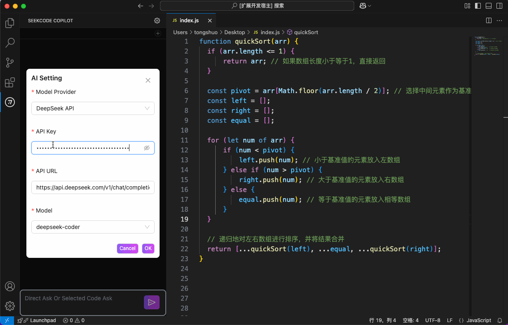

<p align="center">
  <br />
  
</p>


<h1 style="font-size:25px;font-weight:700" align="center">SeekCode Copilot</h1>
<br />


# SeekCodeCopilot - 智能编码助手

**SeekCodeCopilot** 是一款功能强大的 **VSCode 插件**，专为开发者设计，旨在通过智能化的方式提升编码效率与代码质量。它支持 **DeepSeek 大模型** 或本地 **Ollama 部署** 的其他大模型，为开发者提供全方位的编码辅助。


<div align="center" >
 
</div>

## Installation

<div align="center" >
 
</div>


## 配置模型

<div align="center" >
 
</div>


## 主要功能

- **智能问答**：快速解答编程问题，提供技术建议。
- **代码解释**：清晰解释代码逻辑，帮助理解复杂代码。
- **错误检测**：实时检测代码错误，提供修复建议。
- **代码优化**：优化代码结构，提升性能与可读性。
- **代码补全**：在编辑代码过程中，智能提示和补全。(仅限部分支持FIM的模型)

## 核心优势

- **多模型支持**：支持 DeepSeek 或本地 Ollama 部署的大模型，灵活适配不同需求。
- **高效便捷**：无缝集成 VSCode，提供流畅的开发体验。
- **智能辅助**：通过 AI 技术，显著提升开发效率与代码质量。

## 适用场景

- 快速解决编程问题
- 理解与优化现有代码
- 提升代码编写效率
- 学习与探索新技术

## Change Log

#### 版本：0.3.3 日期：2025-03-18
修复使用推理模型，推理过程返回null的bug  
当选择硅基流动平台不支持FIM的模型时，代码补全功能将使用免费的```Qwen/Qwen2.5-Coder-7B-Instruct```模型进行补全。

#### 版本：0.3.2 日期：2025-03-14
实现使用硅基流动api的代码补全功能

#### 版本：0.3.1 日期：2025-03-13
可接入硅基流动平台[......](https://github.com/titusTong/seekCodeCopilot/blob/main/CHANGELOG.md)

## 联系我们

https://github.com/titusTong/seekCodeCopilot

换欢迎在github上提issues.

如果需要进一步了解或有疑问，可以通过微信 412571075 联系开发团队。

如果你有关于如何安装或使用 SeekCode Copilot 的具体问题，或者想要了解更多细节，请告诉我，我会尽力帮助你，并且我们会持续更新迭代。


---

**SeekCodeCopilot** - 让编码更智能、更高效！